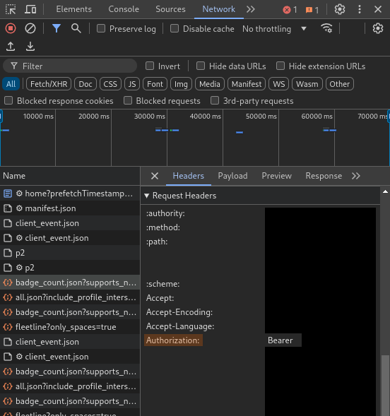
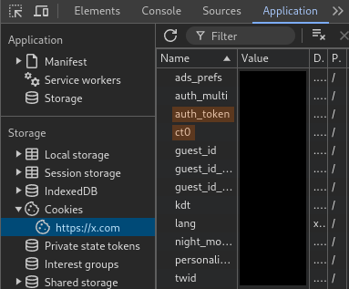

# nuke_tweets
Tool for mass-deleting tweets.

## Disclaimer
Use at your own risk. Basic testing done on my own account. To be further tested and improved.
A few simple to-dos for a near-future update: (1) checking the response status for failure and in general more informative error checking; (2) un-retweeting instead of attempting to delete posts that are retweets not owned by the user.

## Requirements
- Go
- Copy of your ```tweets.js``` file, obtained from downloading your archive

## Usage
After completing setup, navigate to project directory and run
```
go run nuke_tweets
```
It will prompt for an optional keyword, optional cutoff dates, confirm, and then send delete requests for each tweet ID.

## Setup
### tweets.js
You will need to provide your own ```tweets.js``` from downloading your Twitter archive, under the ```data``` folder. Copy and paste it into the main directory (overwrite the blank placeholder file). This file lists all your existing tweets.

The option to download your Twitter archive is available from Settings > Your account. It takes about 24 hours to be available - I've also found the actual download to be quite slow.

### SETUP.txt
You will also need to set your own request header tokens in ```SETUP.txt``` for the request. Note that these tokens are sensitive information just like a password. The request is sent over https.

Your tokens can be found in Chrome Devtools as shown below. Open Devtools while on Twitter and logged into the account that owns the posts to be deleted.

The Authorization Bearer token can be found in the Headers of any request on the Network tab. You can also find the required X-Csrf and Cookie auth_token values here (may have to click around different requests to find one with the Cookie data).

You can also (perhaps more easily) copy the Cookie auth_token value from the Application tab (click the >> for more tabs in Devtools).





Make sure the Authorization token retains the "Bearer " in front of it. It should look something like
```Authorization Token: Bearer AAAAAAAA_LONG_STRING_OF_CHARACTERS```

### Exemptions (optional)
If you would like to preserve any specific tweets, enter these each by ID their own line under ```[EXEMPTIONS]``` in ```SETUP.txt```. (The ID number of a tweet is the long number at the end of its URL; you can also, of course, find tweet IDs in ```tweets.js```.)

The ```deletion_log.txt``` file is also automatically populated with deleted tweets after any batch deletion - this is for simplicity so that you can keep the same tweet-headers.js file if desired and avoid sending hundreds of requests for already-deleted tweets in future deletions.

(For updated data that includes new tweets and does not included deleted ones, you can of course always re-request from Twitter.)
