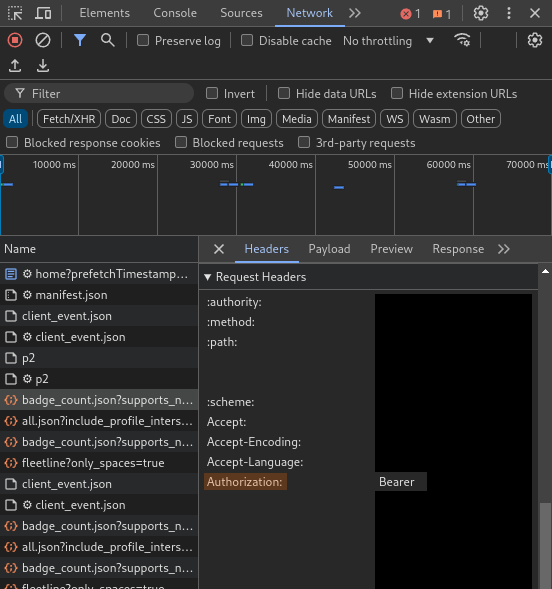
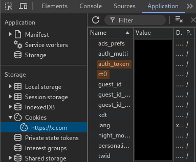

# nuke_tweets
Tool for mass-deleting tweets.

## Disclaimer
Use at your own risk! Only tested on my own account in batches of around 200 tweets. More testing & expansion of the guide and functionality to come.

## Requirements
Latest version of Python3

If it can't find a module, install with pip via command-line, e.g.
```
pip install requests
```

## Setup
You will need to provide your own ```tweet-headers.js``` from downloading your Twitter archive. Copy and paste it into the main directory (overwrite the blank placeholder file). This file lists all your existing tweets with their IDs and creation dates. The ```tweets.js``` file has more info regarding their contents (useful for later versions of this tool).

(The option to download your Twitter archive is available from Settings > Your account. 24-hour turnaround for a zipfile of all your data.)

You will also need to set your own request header tokens in ```headers.txt``` for the user session to work. These can be found in Chrome Devtools as shown below. Open Devtools while on Twitter and logged into the account that owns the posts to be deleted.

The Authorization Bearer token can be found in the Headers of any request on the Network tab. You can also find the required X-Csrf and Cookie auth_token and ct0 values here.



You can also (slightly more easily) copy the Cookie values from the Application tab. You may also note that the Cookie ct0 value is always the same as the X-Csrf token - still copy it in both places in ```headers.txt```.



Make sure to preserve the semicolon in the Cookie header; it should look like
```
Cookie: auth_token=YOUR_VALUE; ct0=YOUR_VALUE
X-Csrf: YOUR_VALUE
Authorization: Bearer YOUR_VALUE
```

Extra headers are fine if you prefer to copy in the full headers, e.g. from another tool, as long as the required values are present.

If you would like to preserve any specific tweets that fall within the cutoff date, enter these each on their own line in ```exempt_tweets.txt```.

The ```exempt_tweets.txt``` file is also automatically populated with deleted tweets after any batch deletion - this is for simplicity so that you can keep the same tweet-headers.js file if desired and avoid sending hundreds of requests for already-deleted tweets in future deletions. 

(For updated data that includes new tweets and does not included deleted ones, you can of course always re-request from Twitter.)

## Usage
Run ```nuke_tweets.py``` after completing setup - it will prompt for a cutoff date, confirm, and then send requests for each tweet ID before the cutoff range.
